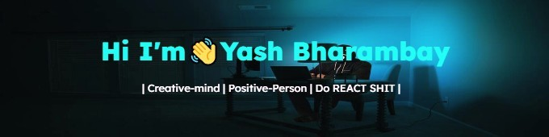
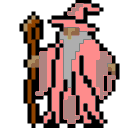
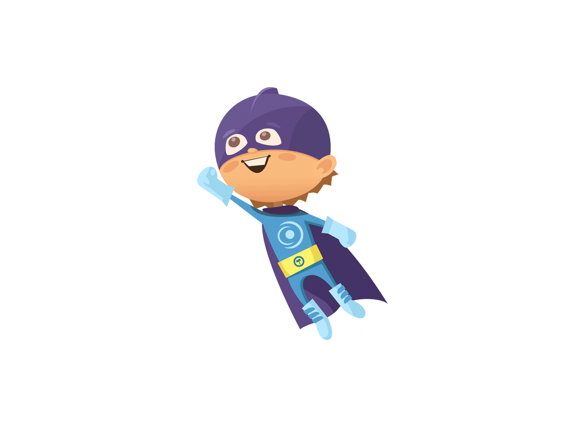

<!--  -->

<!--  -->

<!-- 

### Hi there 👋 I am Yash Bharambay -->

<!-- **YashBharambay/YashBharambay** is a ✨ _special_ ✨ repository because its `README.md` (this file) appears on your GitHub profile. -->

<!-- Here are some ideas to get you started: -->

<!-- - 🔭 I’m currently working on building my profile -->

<!-- - 👀 I’m interested in reactjs, nextjs,aws , blockchain
- 🌱 I’m currently learning blockchain and NodeJS.
- 👯 I’m looking to collaborate to amazing people to help in projects. -->
  <!-- - 🤔 I’m looking for help with ... -->
  <!-- - 💬 Ask me about ... 

      <!-- 📫 How to reach me: ybharambay@gmail.com  -->

  <!-- - 😄 Pronouns: ... -->
<!-- - ⚡ Fun fact: ...I am an Electonics Engineering student
- 📫 My Personal Portfolio website: https://yashbharambay.vercel.app/
- 📫 How to reach me: 
  
  

 -->

# Yash Bharambay&nbsp;

<!--
    &nbsp; 
-->

###  Hello world!&nbsp;

  <em>
    I am an ELectronics Engineering Student  
    20 years of living a comical life!  
    <!-- Team member at <a href="https://dscsrm.com/"> <b>DSC SRM Powered by Google Developers</b></a>  -->
     
    <b>A friendly Neighbourhood Developer</b>  and a <b>Learning    Enthusiast,</b>&nbsp;  who is <b>obsessed</b>
    with the idea of <b>improving</b> himself and wants a <b>platform</b> to 
    <b>grow</b> and 
    <b>excel.</b>   
    I Love <b>Web Development</b>, xD.  
  </em>  

 

-  I’m _currently_ **sleeping** 😴 or _working_ on my **PC** 👨‍💻
-  I’m **good** in **Web Development** and currently learning **Android Development** 💪.
-  I’m _looking to collaborate_ to **Amazing Enthusiasts with fascinating projects**.
<!-- -  I Love **Machine Learning** and **Open CV**🌐 -->
- 🌱 I’m currently exploring **Blockchain** .
-  _Ask me_ about **why do I think aliens 👽 exist.**
-  **Fun fact:** I am an _Electronics Student_ 💡😴
-  Have a look at my Repos💡 & do Leave a **STAR**⭐️ if you like my work👨‍💻.
   

<!-- ## Spotify Playing 🎧

 -->

 

 

 

## Languages and Tools:

<!--   -->
<!--   -->

   

   <!--   -->
   <!--  -->

    <!--  -->

 

# Connect with me

   &nbsp;&nbsp;
   &nbsp;&nbsp;
   &nbsp;&nbsp;
  &nbsp;&nbsp;
    

  

<!-- 
 -->

<!--  Acknowledgement: https://github.com/anuraghazra/github-readme-stats -->
