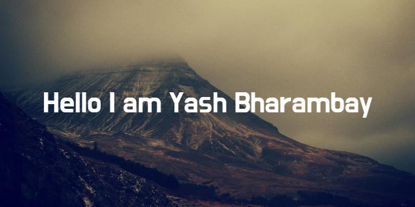

<!--  -->

### Hi there 👋 I am Yash Bharambay

<!-- **YashBharambay/YashBharambay** is a ✨ _special_ ✨ repository because its `README.md` (this file) appears on your GitHub profile. -->

<!-- Here are some ideas to get you started: -->

<!-- - 🔭 I’m currently working on building my profile -->

- 👀 I’m interested in reactjs, nextjs,aws , blockchain
- 🌱 I’m currently learning blockchain and NodeJS.
- 👯 I’m looking to collaborate to amazing people to help in projects.
  <!-- - 🤔 I’m looking for help with ... -->
  <!-- - 💬 Ask me about ... -->
    <!-- - 📫 How to reach me: ybharambay@gmail.com -->
  <!-- - 😄 Pronouns: ... -->
- ⚡ Fun fact: ...I am an Electonics Engineering student
- 📫 My Personal Portfolio website: https://yashbharambay.vercel.app/
- 📫 How to reach me: 
   <a href="<Linkedhttps://www.linkedin.com/in/yash-bharambay-9873b220a/InURL>"></a>

